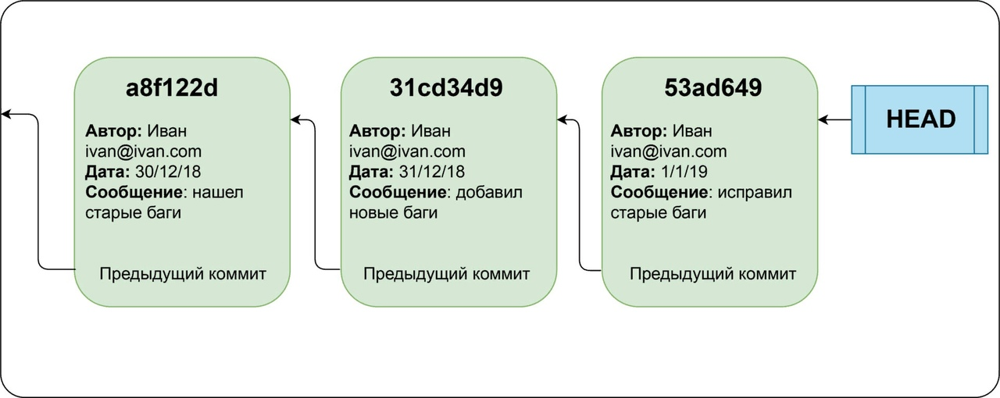

## Команда ***git commit***

>**`git commit`** - это команда для записи индексированных изменений в репозиторий **Git**.
>>Прежде чем создавать очередной коммит, необходимо проиндексировать файлы в рабочей области с помощью команды **`git-add`**.

>>>:white_check_mark: Пример коммита:



:octocat:

Пример 2

```
$ git reset —soft HEAD^
$ ... do something else to come up with the right tree ...
$ git commit -c ORIG_HEAD
```