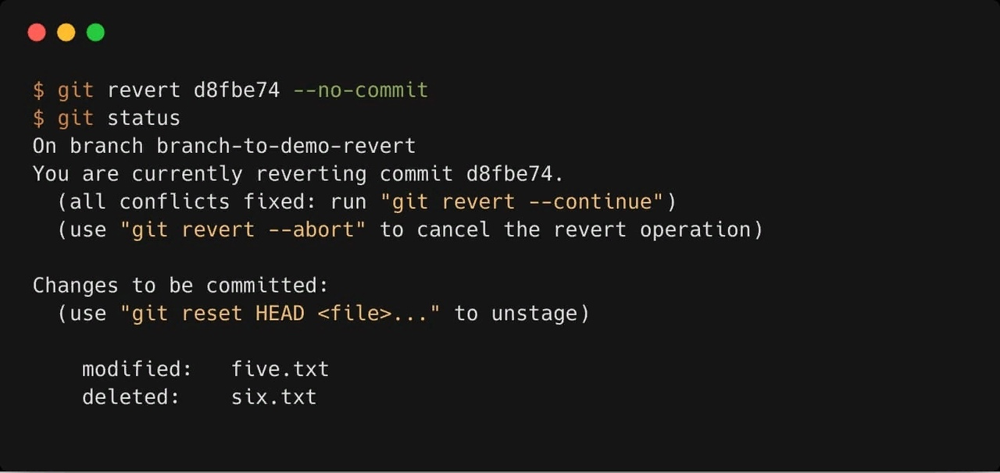

# *Откат последнего коммита*

*Откатить последний коммит можно с помощью параметра revert. Создастся новый коммит, содержащий обратные преобразования относительно предыдущего, и добавится к истории текущей ветки*.

```git revert HEAD```

Пример:exclamation:

:squirrel: