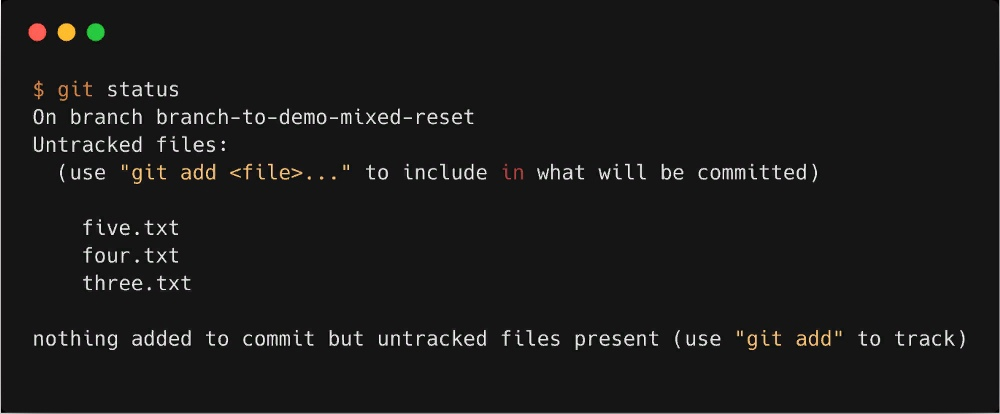

[< К содержанию](readme.md):closed_book:

# Проверка статуса репозитория

Просмотреть статус нужного репозитория можно по ключевому слову **status:** его действие распространяется на подготовленные, неподготовленные и неотслеживаемые файлы.

```git status```
Пример:
